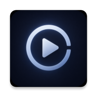
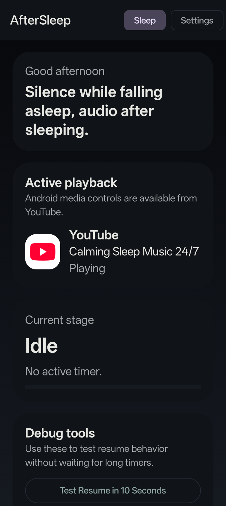
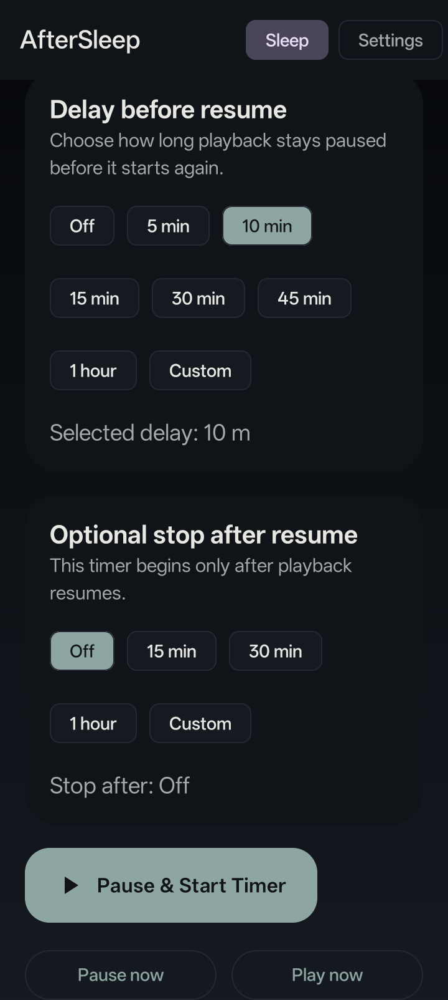
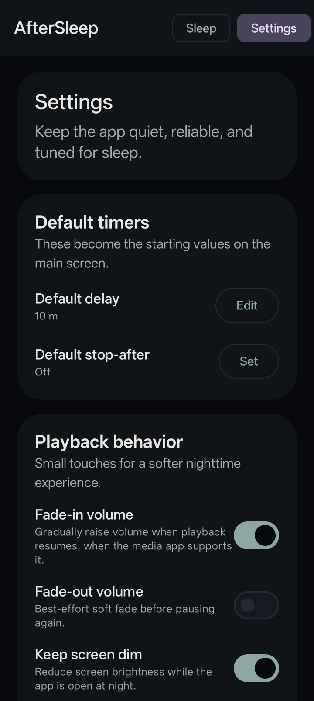
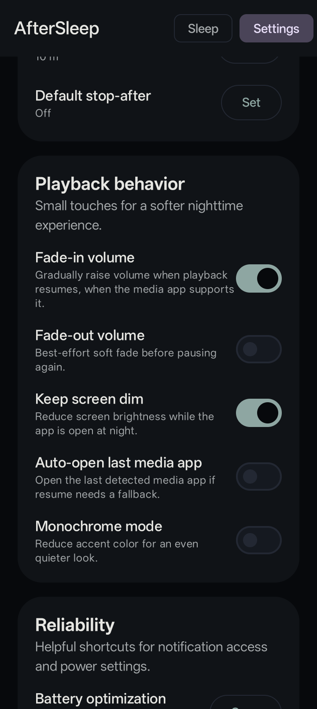

# AfterSleep

[](LICENSE) [](#) [](https://github.com/nihaltp/AfterSleep/releases/latest)



AfterSleep is a Kotlin + Jetpack Compose Android app for delayed media playback control.

## Download

Available on my F-Droid repository:


**Repository URL:**

```text
https://nihaltp.github.io/fdroid/repo/
```

[Open Repo Page](https://nihaltp.github.io/fdroid/repo/) to scan the QR code.

## Highlights

- Dark-only Material 3 UI
- MediaSessionManager and MediaController based playback control
- Foreground service for reliable timers
- Notification listener support for active session detection
- MVVM architecture with StateFlow and coroutines
- Settings for default delay, stop-after, dim screen, monochrome mode, and fallback behavior

## Project layout

- `app/src/main/java/com/nihaltp/aftersleep/data` - repositories and app container
- `app/src/main/java/com/nihaltp/aftersleep/media` - media session discovery and playback control
- `app/src/main/java/com/nihaltp/aftersleep/service` - foreground service and notification listener service
- `app/src/main/java/com/nihaltp/aftersleep/ui` - Compose UI, screens, components, and theme
- `app/src/main/java/com/nihaltp/aftersleep/viewmodel` - viewmodels

## Notes

- Grant notification access and notification permission for the best experience.
- Battery optimization can interfere with overnight timers, so the app includes a shortcut to the relevant Android settings screen.

## Screenshots

Below are phone screenshots included in the `fastlane` metadata folder.

<p align="center">
  
  
  
  
</p>
